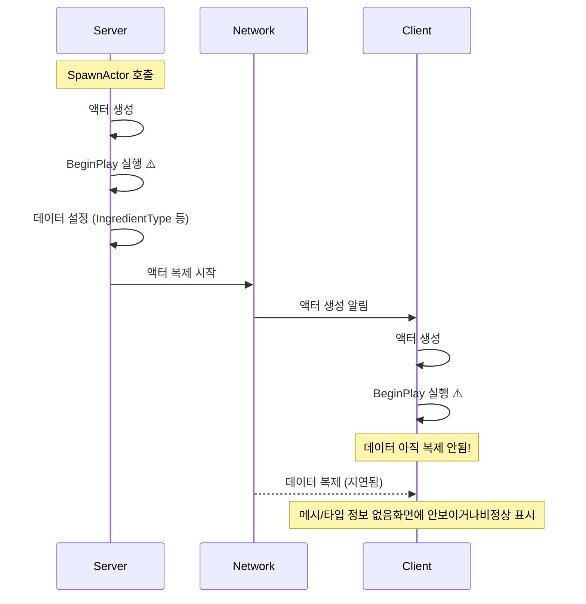
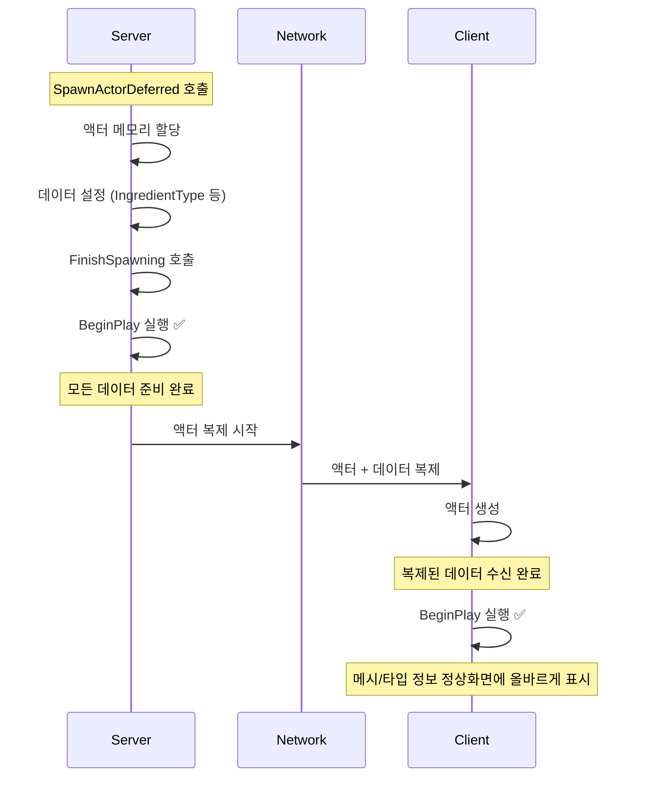

# 💻 클라이언트 프로그래머 포트폴리오

> **"DirectX 엔진 개발 경험을 통해, 엔진의 동작 원리와 효율적인 구조를 고민하는 클라이언트 프로그래머 류성민입니다."**

* Core Competency: 
    * C/C++, Unreal Engine 5, DirectX 11
    * C#, Unity 6
    * AWS, Google Firebase

* Strength:

    * GameplayTag 및 컴포넌트 기반 액션 게임 구현

    * 플러그인 및 SDK 활용 경험(AWS EC2, Lambda, DynamoDB, S3, Google Firebase, Firestore, Admob 등)

    * AWS GameLift 기반의 Dedicated Server 및 Serverless 백엔드 구축 경험

    * Team Project 협업 경험

    * IOCP 기반 멀티스레드 풀 활용하여 로딩 시간 단축(평균 3.3초 -> 0.37초)

## 📄 레포지토리 링크
- 🔗 1. [[UE5] 액션 게임 프로젝트 (25.10 ~ 25. 11)](https://github.com/kabu0330/UE_Soul2) 
- 🔗 2. [[UE5, AWS] Dedicated Server 프로젝트 (25.05 ~ 25.08)](https://github.com/kabu0330/FPS_with_DedicatedServer) 
- 🔗 3. [[UE5 팀 프로젝트] 시뮬레이션 게임 (Overcooked! 2 모작) (25.02 ~ 25.05)](https://github.com/kabu0330/UE_Overcooked2) 
- 🔗 4. [[DirectX 11] 2D 액션 게임 프로젝트 (Hollow Knight 모작) (24.11 ~ 25.02)](https://github.com/kabu0330/DX_HollowKnight2) 
- 🔗 5. [[Win API] 슈팅 게임 프로젝트(The Binding of Isaac 모작) (24.07 ~ 24.11)](https://github.com/kabu0330/WinAPI) 
* [티스토리](https://kabu0129.tistory.com/)

## 📜 목차
1. [Unreal Engine 5] Action RPG Project "Soul"
2. [[Dedicated Server] FPS Game Project](#-2-dedicated-server-project-fps-game)
3. [[Team Project] Unreal Engine ver 'Overooked! 2' 모작](#-3-team-project-unreal-engine-ver-overooked-2-모작)
4. [[Custom Engine Projects] DirectX 11 2D 'HollowKnight' 모작](#-4-custom-engine-projects-directx-11-2d-hollowknight-모작)
5. [Unity] Project TinyRush (개발 중) 
    * [Notion](https://www.notion.so/Project-Tiny-Rush-Technical-Spec-2c14969443dc807abdebca937cabb76d?source=copy_link)

 

## 📄 1. [Unreal Engine 5] Action RPG Project "Soul"

 

* 🔗 [Youtube](https://youtu.be/8U4345QKBfc)
* 🔗 [Github](https://github.com/kabu0330/UE_Soul2)

 

📋 프로젝트 정보
| 항목 | 내용 | 항목 | 내용 |
|:------|:-----|:-----|:-----|
| 🖥️ **플랫폼** | PC (Windows) | 🎮 **장르** | 액션 |
| 👤 **개발 인원** | 1인 | 📅 **개발 기간** | 2025.10 ~ 2025.11 |
| 🛠️ **기술 스택** | C++, Unreal Engine 5, Rider, Git | | |
| 📝 **게임 소개** | 스태미나 기반 전투 액션 게임 | | 
| 🎯 **핵심 목표** | 액션 전투 시스템 개발 | | 
| 📑 **주요 특징** | 콤보 시스템, 무기 시스템, 데이터 기반 아이템 및 인벤토리 시스템, 모션 워핑 | | 

 

* 기술적 도전 & 해결:

    * Zero-Tick Architecture:

        * `Tick()` 사용을 배제하고 `Delegate`와 `AnimNotify`를 활용한 완전한 Event-Driven 구조 구축.

     * 결과: 유휴 상태(Idle)에서의 CPU 점유율 최소화 및 로직 추적 용이성 확보.

    * 유연한 전투 시스템:

        * 거대한 `Character` 클래스를 `ISoulCombat`, `ISoulInteract` 등 인터페이스로 분리.

        * 결과: 신규 몬스터/무기 추가 시 기존 코드 수정 없이 확장 가능하도록 결합도(Coupling) 제거.

    * Data-Driven Skill System:

        * `DataAsset`과 `GameplayTag`를 활용해 코드 컴파일 없이 스킬 속성(데미지, 모션, 이펙트) 제어.

 

### 기능 구현

 

 

 

 

 

 

 

 

 

___

 1. Tick 의존성 해소와 이벤트 기반 설계 (클릭) 

#### 🛠️ 1. Tick 의존성 해소와 이벤트 기반 설계

**🚨 문제 상황**

매 프레임 로직을 호출하고 검사하는 `Polling` 방식은 구현이 직관적이나, 프로젝트 규모가 커질수록 불필요한 연산 부하가 발생하고 로직의 인과관계를 추적하기 어려워 유지보수가 어려워지는 문제를 겪었습니다.

그럼에도 다음과 같은 이점 때문에 `Tick` 기반 방식을 선호했습니다.

1. 중단점(Break Point)을 통한 디버깅의 직관성

2. 매 프레임 호출 보장으로 인한 예외 상황 방지

3. `bool` 값을 활용한 간편한 상태 제어

하지만 Dedicated Server 프로젝트를 진행하며 비동기 로직과 이벤트를 디버깅하는 감각을 익히면서 기존 구조의 한계를 느꼈고 다른 방법으로도 기능을 개발할 수 있다는 시야를 넓혀주었습니다.  
이에 작업 초반부터 과감하게 `Tick` 의존성을 제거하고 이벤트 기반으로 구조로 전환을 결정했습니다.

 

**💭 해결 방안**

플레이어의 행동을 유발하는 **트리거(Trigger)**를 명확히 정의하고, 이를 기점으로 로직이 실행되도록 설계했습니다.

1. 입력: `EnhancedInput` (Action)

2. 애니메이션: `AnimNotify` / `AnimNotifyState`

3. 상태 변화: `Delegate` (Broadcast)

 

**🔧구현 상세**

**1). 입력과 애니메이션의 연쇄 작용**

플레이어의 입력은 단순한 함수 호출이 아닌, 애니메이션 시스템과 결합되어 시각적 피드백과 게임 로직을 동시에 처리합니다.

* `InputAction` + `AnimNotify` 
    - 입력 장치의 신호를 `InputAction`으로 받아 캐릭터 행동(Action)을 트리거합니다.
    - 애니메이션의 특정 프레임에 매핑된 `AnimNotify`및 `AnimNotifyState`가 충돌 검사 시작, 발사체 생성, 이펙트 재생 등의 실질적인 게임 로직을 실행합니다.
    - 이를 통해 "애니메이션과 로직의 불일치(Desync)" 문제를 원천적으로 방지했습니다.
    - [AnimNotifyState_Parry 코드](https://github.com/kabu0330/UE_Soul2/blob/a50d719eae8d32e24b870c4d6342dd97015d2f46/Source/Soul/AnimNotify/AnimNotifyState_Parry.cpp#L15-L37) / 
    [패링 성공 적용 코드](https://github.com/kabu0330/UE_Soul2/blob/a50d719eae8d32e24b870c4d6342dd97015d2f46/Source/Soul/Character/SoulCharacterBase.cpp#L559-L587)

     

* `GameplayTag` + `OnEndedMontageDelegate`
    - `StateComponent`에서 `GameplayTag Container`활용해 캐릭터의 복합 상태(공격 중, 무적, 경직 등)를 관리합니다.
    - `AnimInstance`의 `OnMontageEnded` 델리게이트를 활용하여, 애니메이션이 정상 종료되거나 피격 등으로 중단(Interrupted)되는 모든 상황에서 확실하게 상태 태그를 정리(Clean-up)합니다.
    - [피격 OnMontageEnded 사용 코드](https://github.com/kabu0330/UE_Soul2/blob/a50d719eae8d32e24b870c4d6342dd97015d2f46/Source/Soul/Character/SoulCharacterBase.cpp#L979-L1004)

 **[💡 회고 및 개선점]** 초기에는 `AnimNotify`로 태그를 해제했으나, 블렌드 아웃이나 강제 중단 시 노티파이가 씹히는(Skip) 문제가 있었습니다. 이를 델리게이트 기반의 보장된 콜백으로 변경하여 상태 무결성을 확보했습니다.

 

**2). UI와 캐릭터의 느슨한 결합**

UI(UserWidget)는 캐릭터의 존재를 알지만, 캐릭터는 UI의 존재를 모르게 설계하여 **의존성을 단방향**으로 제한했습니다.

* `Delegate` + `UserWidget` 
    - **[Observer Pattern]** 모든 `UserWidget`은 캐릭터 컴포넌트의 `Delegate`에 바인딩하여 데이터가 변경될 때 `Broadcast`를 통해 값을 받아 위젯을 갱신하는 구조입니다.
    - [PlayerOverlay 코드](https://github.com/kabu0330/UE_Soul2/blob/a50d719eae8d32e24b870c4d6342dd97015d2f46/Source/Soul/UI/Play/SoulPlayOverlay.cpp#L32-L65) /
     [InventoryWidget 코드](https://github.com/kabu0330/UE_Soul2/blob/a50d719eae8d32e24b870c4d6342dd97015d2f46/Source/Soul/UI/Play/Inventory/InventoryWidget.cpp#L17-L21) /
    [EquipmentWidget 코드](https://github.com/kabu0330/UE_Soul2/blob/a50d719eae8d32e24b870c4d6342dd97015d2f46/Source/Soul/UI/Play/Equipment/EquipmentWidget.cpp#L23-L29)

 **[💡 회고 및 개선점]** `PlayerOverlay`는 UI가 캐릭터 컴포넌트에 직접 접근하여 바인딩하는 구조입니다. 이후 개발된 `UserWidget` 클래스는 중재자(Mediator) 역할을 하는 `Manager` 클래스로부터 참조하는 구조로 바꿨으나, `Character`의 `ActorComponent`로 컴포넌트의 생명주기에 의존한 구조로 설정한 것이 아쉽습니다. `Subsystem` 내부 또는 `static class`로 만들었으면 더 좋았겠습니다.

 

**3). 제한적인 Tick 사용**

구간(`AnimNotifyState`)과 타이머(`Timer`)를 사용하여 `Tick`을 완전히 배제하는 것이 아니라, "꼭 필요한 순간에만" 일시적으로 사용하는 전략을 취했습니다.

* `AnimNotifyState` + `Toggle 함수`
    - 상시 충돌 검사 대신, 공격 애니메이션의 타격 구간에만 `AnimNotifyState`를 배치하여 해당 구간 내에서만 `WeaponCollisionComponent`의 `Tick`을 활성화했습니다.
    - [AnimNotifyState_WeaponCollisionState 코드](https://github.com/kabu0330/UE_Soul2/blob/a50d719eae8d32e24b870c4d6342dd97015d2f46/Source/Soul/AnimNotify/AnimNotifyState_WeaponCollision.cpp#L8-L31) / 
    [무기 콜리전 활성화 및 충돌 검사 코드](https://github.com/kabu0330/UE_Soul2/blob/a50d719eae8d32e24b870c4d6342dd97015d2f46/Source/Soul/Components/WeaponCollisionComponent.cpp#L18-L101) 

 

* `Timer`
    - 스태미나 회복과 같이 주기적인 로직은 프레임 레이트와 무관하게 동작해야 하므로 `SetTimer`를 활용하여 0.1초 단위로 명확하게 실행되도록 구현했습니다.
    - [Stamina 회복 코드](https://github.com/kabu0330/UE_Soul2/blob/a50d719eae8d32e24b870c4d6342dd97015d2f46/Source/Soul/Components/AttributeComponent.cpp#L57-L99)

 

___

 2. DataAsset / DataTable, 코드 수정 없이 무기 타입 및 스킬 추가 (클릭) 

#### 🛠️ 2. DataAsset / DataTable, 코드 수정 없이 무기 타입 및 스킬 추가

**🚨 문제 상황**

프로젝트에는 Fist, Sword, Polearm, Katana 등 다양한 무기 타입이 존재하며, 각 무기마다 공격 모션, 데미지, 스태미나 소모량, 콤보 연계가 달라야 했습니다.   이를 코드 내 분기문(`if`/`switch`)이나 하드코딩으로 구현할 경우, 밸런스 조정이나 신규 무기 추가 시마다 재컴파일이 필요하며, 기획 데이터와 로직이 강하게 결합되는 문제가 있었습니다.

 

**💭 해결 방안**

언리얼 엔진의 강력한 장점인 에디터에서 수정하고 바로바로 테스트할 수 있는 환경을 최대한 활용하여 로직(Behavior)과 데이터(Data)를 분리하기 위해 `DataAsset`을 적극 활용했습니다.

* `DataAsset`: 무기의 스킬 구성, 몽타주, 태그 등 "행동 정의" 데이터 (로직에 영향)
* `DataTable`: 아이템 이름, 아이콘, 설명 등 "표시 정보" 데이터 (UI 전용)

특히 `PrimaryDataAsset`을 상속받아 필요한 시점에 비동기 로드할 수 있는 구조를 마련했습니다.

 

 

**🔧구현 상세**

* `FMontageGroup`구조체 활용
    - 단순한 몽타주 배열이 아닌, `TMap<FGameplayTag, FMontageGroup>` 구조를 사용하여 스킬의 종류(태그)에 따라 적절한 애니메이션 그룹을 매핑했습니다.
    - 이를 통해 '기본 공격', '강공격', '대시 공격' 등 다양한 액션을 코드 수정 없이 데이터 할당만으로 정의할 수 있었습니다.
    - [MontageActionData 코드](https://github.com/kabu0330/UE_Soul2/blob/a50d719eae8d32e24b870c4d6342dd97015d2f46/Source/Soul/DataAsset/MontageActionData.h#L11-L47)

**[💡 회고 및 개선점]** 전투 시스템이 고도화되면서(백어택, 잡기 등) `FMontageGroup` 내에 발동 조건 필드가 늘어나는 현상을 겪었습니다. 모든 스킬이 해당 조건을 쓰지 않음에도 구조체가 비대해지는 문제가 있어, 추후에는 조건 검사 로직 자체를 별도의 객체나 컴포넌트로 분리하는 **데코레이터 패턴**을 도입할 예정입니다.

 

 

___

 3. 락 온(Lock-on) 및 타겟 전환 시스템 (클릭) 

#### 🛠️ 3. 락 온(Lock-on) 및 타겟 전환 시스템

 

소울라이크 게임의 핵심인 대상 고정(Lock-on) 및 타겟 스위칭(Target Switching) 기능을 컴포넌트 기반으로 설계하여 유지보수성과 확장성을 확보했습니다.

1. 시스템 구조 (Architecture)

    * 컴포넌트 기반 설계 : 락온 로직을 `UTargetingComponent`에 응집시켜 플레이어 캐릭터의 클래스 무게를 줄이고 코드 재사용성을 높였습니다.

    * 인터페이스 활용 : `ISoulTargeting` 인터페이스를 통해 타게팅 가능한 대상(Enemy)을 추상화했습니다. 이를 통해 특정 클래스에 종속되지 않고, 인터페이스를 상속받은 모든 액터를 대상으로 지정할 수 있는 유연한 설계를 구축했습니다.

2. 핵심 기능 구현 세부 사항
* A. 타겟 탐색 및 필터링 (Target Detection)
    * 스피어 트레이스 (Sphere Trace): `SphereTraceMultiForObjects`를 사용하여 플레이어 주변 일정 반경(TargetingRadius) 내의 모든 잠재적 타겟을 탐색합니다.

    * 유효성 검사: `CanBeTargeted()` 인터페이스 함수를 호출하여 사망 상태이거나 타게팅 불가능한 상태의 액터를 실시간으로 필터링합니다.

* B. 최적 타겟 선정 알고리즘 (Selection Algorithm)
    * 공간 벡터 내적(Dot Product) 활용: 단순히 거리만 계산하는 것이 아니라, 카메라의 **전방 벡터(Forward Vector)**와 캐릭터에서 타겟으로의 **방향 벡터(LookAt Vector)**를 **내적(Dot Product)**하여 카메라 중앙에 가장 가까운 대상을 우선적으로 선택합니다.

* C. 지능형 타겟 스위칭 (Dynamic Target Switching)
    * 상대적 방향 판별: 타겟 전환 시 카메라의 **우측 벡터(Right Vector)**와 대상의 벡터 관계를 계산하여 '왼쪽' 혹은 '오른쪽' 방향에 위치한 적을 정확히 판별합니다.

    * Depth 기반 보정: 락온 시 카메라가 너무 바닥을 향하지 않도록 타겟의 위치(Z축)를 보정하고, RInterpTo를 사용하여 급격한 화면 전환 대신 부드러운 카메라 워킹을 구현했습니다.

3. 기술적 해결 과제 (Problem Solving)
    * 시야 가림 현상 해결: `LineTraceSingle`을 추가로 수행하여 플레이어와 타겟 사이에 장애물(Visibility 채널)이 있는 경우 타겟 후보군에서 제외함으로써 물리적 현실감을 높였습니다.

    * 상태 동기화: 락온 여부에 따라 캐릭터 무브먼트 컴포넌트의 `bOrientRotationToMovement` 필드를 제어하여, 비전투 시에는 이동 방향으로 회전하고 전투(락온) 시에는 대상을 주시하며 스트레이프(Strafe) 이동을 하도록 구현했습니다.

 

**🔧구현 상세**
* 타겟 수집 및 탐색
    - [FindTargets()](https://github.com/kabu0330/UE_Soul2/blob/de26d8cc470370cebc74ad70a98dbdab49de0652/Source/Soul/Components/TargetingComponent.cpp#L121-L160)
* 타겟 선정
    - [FindClosestTarget()](https://github.com/kabu0330/UE_Soul2/blob/de26d8cc470370cebc74ad70a98dbdab49de0652/Source/Soul/Components/TargetingComponent.cpp#L162-L241)

 

 4. 입력 타이밍 기반(Perfect/Mercy) 콤보 시스템 (클릭) 

#### 🛠️ 4. 입력 타이밍 기반(Perfect/Mercy) 콤보 시스템

**🚨 문제 상황**

기존의 타이머 기반 콤보 시스템은 애니메이션 종료 시점에만 입력을 확인하여 다음 공격을 이어가는 방식이었습니다. 
이는 입력 타이밍과 무관하게 정해진 후딜레이(Recovery Frames)를 모두 재생해야 했기 때문에, 플레이어에게 경직되고 답답한 조작감을 주었습니다.   현대 액션 게임에서 흔히 볼 수 있는 **'후딜레이 캔슬(Animation Cancel)'**과 '선입력(Input Buffering)' 시스템을 도입하여 조작감을 부드럽게 개선하고자 했습니다.

 

**💭 해결 방안**

입력 타이밍에 따라 두 가지 방식의 콤보 연계 시스템을 복합적으로 구현했습니다.
1. 퍼펙트 콤보 구간 (Perfect Combo Window): `AnimNotifyState`를 활용하여 애니메이션 특정 구간 내 입력 시, 입력을 기억해뒀다가 `NotifyEnd` 호출 시점에 후딜레이를 즉시 캔슬하고 다음 공격으로 빠르게 연계합니다. (숙련자를 위한 보상)
2. 자비 구간 (Mercy Combo Window): 타이머를 활용하여 퍼펙트 구간을 놓치더라도, 애니메이션 종료 전후 짧은 시간 동안 추가 입력이 들어오면 즉시 다음 콤보로 자연스럽게 연결합니다. (조작 편의성 제공)

 

**🔧구현 상세**

 

* 퍼펙트 콤보(선입력) 구현: 애니메이션 시퀀스 내에 `AnimNotifyState`를 배치하여 입력 허용 구간을 시각적으로 설정하고, 해당 구간 내 입력 감지 시 즉시 몽타주 재생을 중단하고 다음 콤보를 실행합니다.
    - [Perfect Combo Window: 콤보 공격 선입력 실행 코드](https://github.com/kabu0330/UE_Soul2/blob/a50d719eae8d32e24b870c4d6342dd97015d2f46/Source/Soul/Components/CombatComponent.cpp#L225-L257)
    - [Perfect Combo Window: NotifyEnd() 시점 호출 코드](https://github.com/kabu0330/UE_Soul2/blob/a50d719eae8d32e24b870c4d6342dd97015d2f46/Source/Soul/Components/CombatComponent.cpp#L300-L319)
* 자비 구간 구현: 애니메이션 종료 직전부터 일정 시간(`Timer`) 동안 입력 플래그를 활성화하여, 뒤늦게 들어온 입력도 다음 콤보의 트리거로 인정합니다.
    - [Mercy Combo Window 코드](https://github.com/kabu0330/UE_Soul2/blob/a50d719eae8d32e24b870c4d6342dd97015d2f46/Source/Soul/Components/CombatComponent.cpp#L279-L292)
* 통합 공격 로직: 위 두 가지 입력 방식을 하나의 `DoAttack` 함수에서 분기 처리하여, 현재 콤보 카운트와 입력 시점에 따라 적절한 다음 행동을 결정합니다.   
    - [실제 Player 공격 함수(DoAttack) 코드](https://github.com/kabu0330/UE_Soul2/blob/a50d719eae8d32e24b870c4d6342dd97015d2f46/Source/Soul/Character/SoulPlayerCharacter.cpp#L245-L304)

 

___

 5. [리팩토링] 인터페이스 도입 (클릭) 

#### 🛠️ 5. [리팩토링] 인터페이스 도입

**🚨 문제 상황**

전투 시스템의 뼈대가 갖춰지고 콘텐츠를 확장하는 과정에서 두 가지 구조적 문제에 직면했습니다.

1. 높은 결합도(Tight Coupling): `AnimNotifyState`나 아이템 클래스 등이 구체적인 캐릭터 클래스(`ASoulCharacterBase`)를 직접 참조하고 캐스팅해야 했습니다.

2. 비대한 추상 클래스(Bloated Base Class): `ASoulCharacterBase`에 플레이어 전용 기능(캐릭터 전용 스켈레탈 메시 또는 컴포넌트)이 증가함에 따라, `Enemy` 클래스가 불필요한 기능까지 상속받는 문제가 있었습니다.

기존에는 상속(Inheritance)만으로 코드 재사용성을 높이려 했으나, 타게팅, 잡기 등 시스템이 고도화될수록 유연한 확장을 위해서는 **'기능 중심 분리**가 필요하다는 생각이 들었습니다.

 

**💭 해결 방안**

거대했던 캐릭터의 기능을 역할별로 잘게 나누어 인터페이스로 정의했습니다.(ISP, 인터페이스 분리 원칙 적용) 이를 통해 각 객체는 자신이 필요한 기능(계약)만 구현하도록 강제했습니다. 
1. `ISoulCombat` : 전투의 핵심 기능(공격, 피격, 방어 등) 정의. 전투가 가능한 모든 객체가 구현.
2. `IPlayerCharacter` : 인벤토리, UI 메시지 등 플레이어 전용 기능 정의.
3. `IEnemy`: AI 공격 수행 등 몬스터 전용 기능 정의.
4. `ISoulTargeting` : 락온 대상으로 지정될 수 있는 기능 정의. 몬스터뿐 아니라 파괴 가능한 오브젝트도 구현 가능.
5. `ISoulInteract`: 아이템 획득 등 상호작용 기능 정의.

또한, 추상 클래스(`ASoulCharacterBase`)를 재분석하여 플레이어/몬스터 중 한쪽에서만 유효한 프로퍼티와 함수를 각각의 파생 클래스로 이전시켜, 상속 구조를 경량화했습니다.

 

**🔧구현 상세**

- [ISoulCombat 인터페이스 코드](https://github.com/kabu0330/UE_Soul2/blob/a50d719eae8d32e24b870c4d6342dd97015d2f46/Source/Soul/Interface/SoulCombat.h)

- [AnimNotifyState 인터페이스 호출 리팩토링 코드](https://github.com/kabu0330/UE_Soul2/blob/a50d719eae8d32e24b870c4d6342dd97015d2f46/Source/Soul/AnimNotify/AnimNotifyState_WeaponCollision.cpp#L8-L20)

- [장비 장착 로직 인터페이스 리팩토링 코드](https://github.com/kabu0330/UE_Soul2/blob/a50d719eae8d32e24b870c4d6342dd97015d2f46/Source/Soul/Equipment/SoulArmour.cpp#L50-L70)

* 리팩토링 효과 (Before & After):

1. 확장성: AnimNotify는 이제 대상이 누구든 ISoulCombat만 구현하면 작동합니다. 추후 다른 캐릭터 클래스가 추가되더라도 기존 코드를 수정할 필요가 없습니다. (OCP 준수)

2. 결합도 감소: 구체적인 클래스 캐스팅이 인터페이스 캐스팅으로 대체되어 시스템 간 의존성이 현저히 낮아졌습니다.

 

#### 프로젝트 관련 글(Blog)

* [인벤토리 시스템과 UI](https://kabu0129.tistory.com/378)
* [루트모션 기반 대시 구현](https://kabu0129.tistory.com/376)
* [PlayerController가 입력을 처리하는게 적절한가?](https://kabu0129.tistory.com/387)
* [OCP(개방 폐쇄 원칙) 기반 설계: 상속에서 인터페이스로 전환](https://kabu0129.tistory.com/388)

 

## 📄 2. [Dedicated Server Project] FPS Game

 

* 🔗 [Youtube 플레이 영상](https://youtu.be/8tyiK_7egvI?si=MP7l8gBIcKs95v6U)
* 🔗 [youtube 테스트 영상](https://youtu.be/uA46fG5gGeU?si=_E-R7NCcEHDxy8vY)
* 🔗 [Github](https://github.com/kabu0330/FPS_with_DedicatedServer)

 

### 📋 프로젝트 정보

| 항목 | 내용 | 항목 | 내용 |
|:------|:-----|:-----|:-----|
| 🖥️ **플랫폼** | PC (Windows) | 🎮 **장르** | FPS |
| 👤 **개발 인원** | 1인 | 📅 **개발 기간** | 2025.05 ~ 2025.08 |
| 🛠️ **기술 스택** | C++, Node.js, Unreal Engine 5, AWS, Rider, Git |
| 📝 **게임 소개** | 최대 10인의 플레이어가 경쟁하는 1인칭 슈팅게임 |
| 🎯 **핵심 목표** | 서버-클라이언트 아키텍처 및 AWS 클라우드 인프라 실전 경험 | | 
| 📑 **주요 특징** | AWS SDK C++ 빌드 및 UE 연동, SeamlessTravel, 네트워크 대역폭 최적화  | | 

 

서버에 대한 개념을 이해하고자 AWS 서비스(EC2, GameLift, Lambda, Cognito, CloudWatch, DynamoDB)를 활용해 데디케이티드 서버를 구축하고 사용자 관리, 세션, 토큰, 서버리스 아키텍처, DB 등 개념을 이해하고 언리얼 엔진과 연동해 언리얼 엔진의 구조 안에서 서버를 구축하고 서버-클라이언트 간 로직을 분리하고 결합하며 게임을 완성해나갔습니다.

* 목표: 상용 게임 수준의 라이브 서비스 아키텍처 구축 (매치메이킹, DB, 로그)

* 기술적 도전 & 해결:

    * Network Bandwidth Optimization: FFastArraySerializer를 구현하여 변경된 데이터(Delta)만 전송, 배열 복제 대비 네트워크 부하 감소.

    * Seamless Travel Data Persistence: 레벨 전환 시 소실되는 데이터를 GameInstanceSubsystem과 PlayerState::CopyProperties 재정의를 통해 보존 파이프라인 구축.

    * Serverless Matchmaking: EC2 상시 구동 비용 절감을 위해 AWS Lambda + API Gateway 기반의 온디맨드 매치메이킹 시스템 구현.

 

### 기능구현

 

 

 

 

 

___

 1. 네트워크 대역폭 최적화 (클릭) 

#### 🛠️ 1. 네트워크 대역폭 최적화

**🚨 문제 상황**

서버에 접속한 플레이어들을 관리하기 위해 일반 배열(TArray)을 사용하게 될 경우, 하나의 수정 사항이 발생해도 배열 전체를 네트워크 전송되어 심각한 대역폭 낭비가 발생합니다.   해당 문제를 변경사항이 발생한 원소만 특정(`MarkItemDirty`)하여 네트워크 전송을 한다면 획기적으로 대역폭 낭비를 줄일 수 있습니다.

 

**💭 해결 방안**

 

 

언리얼 엔진에서 제공하는 `FFastArraySerializer` 문서를 바탕으로 변경된 요소(Delta)만 선별적으로 전송하는 구조로 최적화하여 네트워크 대역폭을 감소시켰습니다.
 

**🔧구현 상세**

해당 코드는 `OpenLevel` 이후 `LobbyGameMode`에 접속된 유저들의 데이터 정보(Username, 준비완료 유무)를 저장/갱신/삭제하는 코드입니다.

- [FastTArraySerializer 코드](https://github.com/kabu0330/FPS_with_DedicatedServer/blob/a8682a0281375c614d704531e462e7c340a0622b/Source/DedicatedServers/Private/Lobby/LobbyPlayerInfo.cpp#L5-L63)
- [GameMode FastTArraySerializer 코드](https://github.com/kabu0330/FPS_with_DedicatedServer/blob/main/Source/DedicatedServers/Private/Game/DS_LobbyGameMode.cpp#L104-L142)
- [GameState FastTArraySerializer 코드](https://github.com/kabu0330/FPS_with_DedicatedServer/blob/a8682a0281375c614d704531e462e7c340a0622b/Source/DedicatedServers/Private/Lobby/LobbyState.cpp#L20-L83)

 

___

 2. Seamless Travel과 데이터 보존 (클릭) 

#### 🛠️ 2. Seamless Travel과 데이터 보존

**🚨 문제 상황**

로비에서 PlayLevel로 매끄러운 이동을 위해 Seamless Travel을 도입하는 과정에서, 레벨 전환 시 액터가 재생성되며 중요한 데이터가 소실되는 구조적 문제에 직면했습니다.

1. 서버 영속 데이터: AWS와 통신하기 위한 파라미터와 함수들이 `GameMode`에 존재하여, 레벨 전환 시 `GameMode`가 교체되면서 정보가 유실되었습니다.

2. 클라이언트 영속 데이터: 플레이어의 세션 정보와 인증 토큰도 레벨이 바뀌더라도 유지되어야 했으나, 마땅한 저장소를 찾기 어려웠습니다.

3. 플레이어 게임 데이터: 사용자 이름 등 게임 플레이에 복제되어야 할 필수적인 정보가 담긴 PlayerState 역시 레벨 전환 시 초기화되어 데이터 정합성이 깨지는 문제가 발생했습니다.

 

**💭 해결 방안**

언리얼 엔진의 객체 생명주기(Object Lifecycle)를 깊이 이해하고, 레벨 전환과 무관하게 유지되는 **하위 시스템(Subsystem)**과 데이터 보존 메커니즘을 적극 활용했습니다.

**1). 서버 전역 데이터 저장소 : `GameInstanceSubsystem`**

`GameInstance`는 게임 프로세스 전체 생명주기와 함께하는 유일한 객체입니다. 서버 실행 중 영구적으로 유지되어야 할 AWS 통신 관련 데이터와 함수들을 `GameInstanceSubsystem`으로 이관하여 레벨 전환의 영향을 받지 않도록 격리했습니다. 초기화 로직만 `LobbyGameMode`에 남겨 역할 책임을 명확히 했습니다.

**2). 클라이언트 로컬 데이터 저장소 : `LocalPlayerSubsystem`**

클라이언트별로 유지되어야 하는 세션 및 토큰 정보는 로컬 플레이어를 대표하는 `LocalPlayerSubsystem`에 저장했습니다. 특히 인증 토큰은 만료되지 않도록 서브시스템 내에서 타이머를 활용해 주기적으로 자동 갱신하는 로직을 구현했습니다.

**3). 플레이어 데이터 저장소 : `PlayerState::CopyProperties` / `PlayerState::OverrideWith`**

`PlayerState`의 데이터는 네트워크를 통해 다른 클라이언트와 공유되어야 하므로 `PlayerController`가 아닌 `PlayerState`에 저장하는 것이 옳다고 판단했습니다. Seamless Travel 시 언리얼 엔진은 구 레벨의 `PlayerState`를 신규 레벨로 복사하는 과정을 거치는데, 이때 사용자 정의 프로퍼티는 자동으로 복사되지 않습니다. 이를 해결하기 위해 `CopyProperties`(구→임시 복사)와 `OverrideWith`(임시→신규 덮어쓰기) 함수를 재정의하여 수동으로 데이터를 이전하는 파이프라인을 구축했습니다.

 **[💡 회고 및 개선점]** 이 과정은 서버 개발의 어려움을 온몸으로 체감하는 계기였습니다. 로컬 환경의 IP 변경으로 인한 AWS 통신 오류부터, 중단점(Breakpoint)을 사용할 수 없는 라이브 서버 환경까지 수많은 난관이 있었습니다. 오직 로그(Log)에 의존하여 문제를 추적하고 해결하는 과정을 통해 로그 시스템 설계의 중요성을 절감했고, 서버 디버깅에 대한 실질적인 노하우를 쌓을 수 있었던 값진 경험이었습니다.

 

**🔧구현 상세**

* 1). 서버 데이터 (AWS 통신)
    - [GameMode::BeginPlay 초기화 코드](https://github.com/kabu0330/FPS_with_DedicatedServer/blob/a8682a0281375c614d704531e462e7c340a0622b/Source/DedicatedServers/Private/Game/DS_LobbyGameMode.cpp#L248-L267)
    - [GameInstanceSubsysem 영속 데이터 관리](https://github.com/kabu0330/FPS_with_DedicatedServer/blob/a8682a0281375c614d704531e462e7c340a0622b/Source/DedicatedServers/Public/Game/DS_GameInstanceSubsystem.h#L18-L44)

* 2). 클라이언트 데이터 (세션/토큰)
    - [LocalPlayerSubsystem 로컬 데이터 관리](https://github.com/kabu0330/FPS_with_DedicatedServer/blob/a8682a0281375c614d704531e462e7c340a0622b/Source/DedicatedServers/Private/Player/DS_LocalPlayerSubsystem.cpp#L9-L41)

* 3). 플레이어 데이터 (Seamless Travel 보존)
    - [DefaultPlayerState 코드](https://github.com/kabu0330/FPS_with_DedicatedServer/blob/a8682a0281375c614d704531e462e7c340a0622b/Source/DedicatedServers/Private/Player/DS_DefaultPlayerState.cpp#L20-L45)

 

___

 3. 서버리스(Serverless) 기반 백엔드 구축 (클릭) 

#### 🛠️ 3. 서버리스(Serverless) 기반 백엔드 구축

**📋 도입 배경**

Dedicated Server는 게임 플레이 자체에 집중해야 하므로, 사용자 인증, 매치메이킹 요청, DB 입출력과 같은 게임 외적인 백엔드 로직을 처리할 별도의 시스템이 필요했습니다. 이를 위해 별도의 EC2 서버를 구축하고 관리하는 것은 개발 및 운영 비용 측면에서 비효율적이라고 판단했습니다.

 

**💭 해결 방안**

필요할 때만 코드를 실행하여 비용 효율적이고 관리 부담이 적은 서버리스(Serverless) 아키텍처를 도입했습니다. AWS Lambda를 백엔드의 핵심 로직 처리기로 삼고, API Gateway를 통해 언리얼 엔진과 통신하며, GameLift, Cognito, DynamoDB 등과 유기적으로 연동되는 구조를 설계했습니다.

 

 

**🔧구현 상세**

1. AWS Lambda 함수 (Node.js)

    - 매치메이킹 중계: 클라이언트의 요청을 받아 GameLift 서비스에 적절한 게임 세션 생성을 요청하고, 접속 정보(IP, Port)를 반환하는 중계자 역할을 수행했습니다.
    - 보안 및 DB 무결성: 클라이언트가 DynamoDB에 직접 접근하는 것을 차단하고, 오직 적절한 **IAM 역할(Role)**을 부여받은 Lambda 함수를 통해서만 유저 정보와 전적 데이터를 안전하게 조작하도록 구현했습니다.

  
  

 

 

 

2. 언리얼 엔진과의 유기적 통합 (HTTP & JSON)

    - 비동기 통신: 언리얼 엔진의 HTTP 모듈을 활용하여 API Gateway 엔드포인트로 RESTful API 요청을 보내고, 비동기(OnProcessRequestComplete)로 응답을 처리했습니다.
        - [로그인 코드](https://github.com/kabu0330/FPS_with_DedicatedServer/blob/a8682a0281375c614d704531e462e7c340a0622b/Source/DedicatedServers/Private/UI/Portal/PortalManager.cpp#L17-L81) / [전적 검색 코드](https://github.com/kabu0330/FPS_with_DedicatedServer/blob/main/Source/DedicatedServers/Private/UI/GameStats/GameStatsManager.cpp#L52-L104)
    - 데이터 파싱: Lambda로부터 받은 JSON 응답 데이터를 언리얼 엔진의 리플렉션(Reflection) 시스템을 활용한 JsonUtilities(FJsonObjectConverter)를 통해 사전에 정의된 USTRUCT 구조체로 자동 매핑 및 파싱하여, 수동 파싱 코드 없이 효율적으로 게임 로직에 반영했습니다

 

  
  

 

3. 운영 및 모니터링 (CloudWatch)

    - 서버리스 환경의 특성상 실시간 디버깅이 어렵다는 점을 극복하기 위해, CloudWatch Logs를 적극 활용했습니다. Lambda 함수의 실행 로그와 오류 메시지를 분석하여 이슈를 신속하게 파악하고 해결하는 운영 노하우를 쌓았습니다.

 

#### 프로젝트 관련 글(Blog)

Dedicated Sever와 관련한 작업은 블로그에 과정을 기록해두었습니다.

* [Blog 'Unreal Engine/Dedicated Server' Category](https://kabu0129.tistory.com/category/Unreal%20Engine/Dedicated%20Server)

 

## 📄 3. [Team Project] Unreal Engine ver 'Overooked! 2' 모작

 

* 🔗 [Youtube](https://youtu.be/zs3aQ8tSZ3E?si=R2VaHZ-xt10g0D2M)
* 🔗 [Github](https://github.com/kabu0330/UE_Overcooked2)

 

📋 프로젝트 정보
| 항목 | 내용 | 항목 | 내용 |
|:------|:-----|:-----|:-----|
| 🖥️ **플랫폼** | PC (Windows) | 🎮 **장르** | 시뮬레이션 |
| 👤 **개발 인원** | 6인 | 📅 **개발 기간** | 2025.02 ~ 2025.05 |
| 🛠️ **개발 도구** | C++, Unreal Engine 5, Visual Studio, Git |
| 📝 **게임 소개** | 최대 4인의 플레이어가 함께 재료를 전달/손질/조합하여   제한 시간 내에 최대한 많은 요리를 제출하는 협동 게임|
| 🎯 **핵심 목표** | 협업 방식을 학습하고 멀티 플레이어 게임을 구현하는 방법을 습득 | | 
| 📑 **주요 특징** | 데이터 기반 요리 컨텐츠 개발, 레벨 디자인, RPC / Replication | | 

 

언리얼 엔진을 본격적으로 학습함과 동시에 처음으로 협업을 통해 하나의 게임을 완성시켜나가는 과정을 경험했습니다. 처음으로 멀티플레이 게임에 대해 학습하며 동기화 이슈에 대해 끊임없이 고민하고 해결해나가며 네트워크 게임의 구조를 깊이 이해하는 시간이었습니다. 이 과정에서 버전 관리의 중요성과 충돌 문제를 해결하는 방법을 배웠고, Pork / Full Request 협업 방식과 git stash에 대해 알게되었습니다.

* 목표: 6인 협업을 통한 실시간 네트워크 멀티플레이 동기화 및 데이터 기반(Data-Driven) 상호작용 시스템 구축.

* 기술적 도전 & 해결 :

    * Lifecycle-Aware Network Spawning (객체 생명주기 제어):

        * 문제: SpawnActor 직후 서버의 데이터 복제(Replication)보다 클라이언트의 BeginPlay가 먼저 실행되어, 초기화되지 않은 데이터(재료 타입 등)로 인해 렌더링 오류가 발생하는 Race Condition 확인.

        * 해결: **SpawnActorDeferred**를 도입하여 [메모리 할당 → Replicated 데이터 초기화 → 스폰 완료(FinishSpawning)] 순으로 생명주기를 재설계. 클라이언트 BeginPlay 시점의 데이터 무결성을 보장하여 동기화 타이밍 이슈 해결.

    * Data-Driven Recipe System (데이터 기반 설계):

        * 문제: 재료의 상태(손질, 굽기 등)와 다양한 조합식(Recipe)을 if/switch 분기문으로 처리할 경우, 콘텐츠 추가 시 코드 복잡도가 기하급수적으로 증가.

        * 해결: 재료를 Type과 State 구조체로 추상화하고, 조합 로직을 **DataTable**로 분리. '접시(Plate)' 객체가 현재 담긴 재료 배열을 테이블과 대조하여 결과물(Mesh)을 동적으로 교체하도록 구현. (OCP 준수)

    * Optimized Collaboration Pipeline (협업 파이프라인):

        * 해결: 6인 개발 환경에서 Binary Asset(.uasset) 충돌 방지를 위해 기능별 폴더 구조화 및 Git Stash / Lock 워크플로우 정립. RPC(Remote Procedure Call) 권한 분리를 명확히 하여 멀티플레이 로직 충돌 최소화.

 

### 기능구현

 

 

___

 1. 동적 액터의 네트워크 동기화와 타이밍 이슈 해결 (클릭) 

#### 🛠️ 1. 동적 액터의 네트워크 동기화와 타이밍 이슈 해결

**🚨 문제 상황**

플레이어 상호작용으로 런타임에 생성되는 재료(`Ingredient`) 액터가 클라이언트 화면에서 보이지 않거나, 데이터(메시, 타입 등)가 비정상적으로 표시되는 문제가 발생했습니다. 원인은 `SpawnActor` 호출 시, 서버에서는 데이터 설정 전에 `BeginPlay`가 실행되고, 클라이언트에서는 데이터가 복제되기 전에 `BeginPlay`가 실행되는 등 초기화와 복제 타이밍의 불일치 때문이었습니다.

 

**💭 해결 방안**

액터 생성과 초기화를 분리하는 지연 스폰(Deferred Spawn) 방식을 도입했습니다. `SpawnActorDeferred`를 사용하여 액터를 메모리에 먼저 할당한 뒤, 필요한 Replicated 데이터(예: 재료 타입)를 설정하고, 마지막으로 `FinishSpawning`을 호출하여 `BeginPlay`가 실행되도록 했습니다. 이로써 `BeginPlay` 시점에는 모든 데이터가 안전하게 복제된 상태임을 보장했습니다.

**❌ 기존 방식 (SpawnActor)**

**✅ 개선 방식 (SpawnActorDeferred)**

 

**🔧구현 상세**

- 서버: SpawnActorDeferred → Replicated 변수 설정 → FinishSpawning 호출 순서로 구현.
    - [Server 재료 스폰 코드](https://github.com/kabu0330/UE_Overcooked2/blob/fa2b9ce77865d74c9d8ebb40c070b3c568b2ac21/Overcooked2/Source/Overcooked2/Global/Component/SpawnManageComponent.cpp#L18-L38)

- 클라이언트: BeginPlay에서 이미 복제된 데이터를 안전하게 사용하여 메시와 아이콘을 설정.
    - [Ingredient 초기화 코드](https://github.com/kabu0330/UE_Overcooked2/blob/fa2b9ce77865d74c9d8ebb40c070b3c568b2ac21/Overcooked2/Source/Overcooked2/LevelContent/Cook/Ingredient.cpp#L32-L107)

 **[💡 회고 및 개선점]** 이 경험을 통해 멀티플레이어 환경에서 객체의 생명주기(Lifecycle)와 네트워크 복제 순서를 이해하는 것이 얼마나 중요한지 깨달았습니다. 단순히 변수를 Replicated로 설정하는 것을 넘어, "언제" 복제되고 "언제" 사용되는지를 고려하는 설계 시각을 갖게 되었습니다.

 

___

 2. 데이터 기반(Data-Driven) 요리 시스템 (클릭) 

#### 🛠️ 2. 데이터 기반(Data-Driven) 요리 시스템

**🚨 문제 상황**

요리 레시피는 다양하고, 재료의 조합 규칙이 존재하나, 조합 순서에 제약이 없고, 조합에 따라 메시가 변화하는 요리 컨텐츠를 구현해야 했습니다. 조건이 복잡하기 때문에 분기문으로 처리하는 것은 최악의 방법입니다. 반드시 데이터 기반 방식으로 컨텐츠를 구현해야 하는데, 어떻게 구조를 잡아야 할지 일주일 가까이 수도 코드를 작성하며 구조를 잡아나갔습니다.

 

**💭 해결 방안**

**1). 재료는 직접 데이터를 가지지 않는다.**

재료는 타입(Type)과 상태(State). 두가지 데이터로 정의했습니다. 

* 물고기 - 손질
* 새우 - 손질
* 김 - 완제품
* 밥 - 끓이기

재료는 타입과 상태로 손쉽게 정의할 수 있었습니다. 문제는 원작 게임은 조리 과정을 여러 번 거치는 재료가 존재한다는 점입니다. 해당 문제는 데이터 테이블의 구조체가 타입과 상태를 배열로 정의한다는 규칙을 추가하여 해결했습니다.

 

 

**2). 접시 == 요리**

원작 게임의 재밌는 규칙 중 하나가, "재료의 조합은 접시 위에서만 가능하다"는 것입니다. 이 점에 착안해 요리라는 개념의 모든 기능을 접시(`Plate`) 클래스 하나로 정리했습니다. 이로써 요리 컨텐츠는 재료와 접시, 조리도구 세 개의 클래스로 컨텐츠를 완성할 수 있습니다.

접시는 재료의 타입과 상태를 배열로 저장하고 해당 데이터를 서버에 넘겨 데이터 테이블에서 조회 후 메시만 바꾸는 객체입니다.

 

 

**🔧구현 상세**

* [재료 데이터 테이블 구현 코드](https://github.com/kabu0330/UE_Overcooked2/blob/fa2b9ce77865d74c9d8ebb40c070b3c568b2ac21/Overcooked2/Source/Overcooked2/Global/Data/IngredientDataTable.h#L11-L53)

* [요리 데이터 테이블 구현 코드](https://github.com/kabu0330/UE_Overcooked2/blob/fa2b9ce77865d74c9d8ebb40c070b3c568b2ac21/Overcooked2/Source/Overcooked2/Global/Data/RecipeDataTable.h#L11-L36)

* [요리 조합 검사 코드](https://github.com/kabu0330/UE_Overcooked2/blob/fa2b9ce77865d74c9d8ebb40c070b3c568b2ac21/Overcooked2/Source/Overcooked2/Global/OC2GameInstance.cpp#L354-L416)

 **[💡 회고 및 개선점]** 데이터 기반 설계를 통해 새로운 요리를 추가할 때 코드 수정 없이 데이터 테이블 행(Row)만 추가하면 되는 유연한 시스템을 구축할 수 있었습니다. 이를 통해 기획자가 직접 밸런싱과 콘텐츠 추가를 할 수 있는 환경을 마련하여 팀 전체의 개발 효율성을 높였습니다.

 

___

 3. 협업 (클릭) 

#### 🛠️ 3. 협업

**🚨 문제 상황**

6명의 팀원이 동시에 작업하면서 바이너리 파일(.uasset) 충돌이 빈번하게 발생했습니다. 특히 레벨이나 공용 블루프린트를 수정할 때 충돌이 나면 병합(Merge)이 불가능해 한 명의 작업 내용이 유실되는 등 개발에 큰 차질이 빚어졌습니다. 초기 도입했던 Git Flow 방식은 리뷰 대기 시간으로 인해 작업 속도를 저하시키는 문제도 있었습니다.

 

**💭 해결 방안**

팀의 규모와 프로젝트 특성에 맞춰 협업 워크플로우를 재정립했습니다.

1. 작업 영역 분리: 팀원별로 담당 클래스와 폴더를 명확히 나누어 충돌 가능성을 최소화했습니다.

2. 에셋 잠금(Locking) 문화: 공용 에셋 수정 시 메신저를 통해 "작업 중"임을 공유하고 다른 팀원의 수정을 방지하는 문화를 정착시켰습니다.

3. Git Stash 활용: 충돌 발생 시 작업 내용을 잃지 않고 안전하게 최신 버전과 병합하기 위해 git stash 활용법을 팀 내에 전파하고 적극 사용했습니다.

 

 **[💡 회고 및 개선점]** 기술적인 문제 해결뿐만 아니라, 팀원 간의 소통과 합의된 규칙이 원활한 협업의 핵심임을 깨달았습니다. 도구나 방법론 자체보다 팀의 상황에 맞는 최적의 프로세스를 찾아 적용하는 능력을 기를 수 있었습니다.

 
 

## 📄 4. [Custom Engine Projects] DirectX 11 2D 'HollowKnight' 모작

 

* 🔗 [Youtube](https://youtu.be/vi6KnUeedrs?si=nJsI59Pi36cGy-Rn)
* 🔗 [Github](https://github.com/kabu0330/DX_HollowKnight2)

 

📋 프로젝트 정보

| 항목 | 내용 | 항목 | 내용 |
|:------|:-----|:-----|:-----|
| 🖥️ **플랫폼** | PC (Windows) | 🎮 **장르** | 액션, 메트로베니아 |
| 👤 **개발 인원** | 1인 | 📅 **개발 기간** | 2024.11 ~ 2025.02 |
| 🛠️ **개발 도구** | C++, Visual Studio, Git, ImGUI |
| 📝 **게임 소개** | 액션 기반 전투 게임 |
| 🎯 **핵심 목표** | DirectX 11를 활용한 게임 개발 | | 
| 📑 **주요 특징** | Actor-Component 패턴(Actor/Scene, FSM, Renderer, Collision 등) | | 

 

게임 엔진을 구현해보며 프로그램이 어떻게 운영체제에서 실행되는지 머릿 속에 그려볼 수 있었습니다. 언리얼 엔진의 프레임워크를 구현해보며 **UE5의 설계 철학**을 이해하게 되었습니다. "왜 상속 기반 구조로 구성되었는가", "어떻게 Component가 Actor에 부착하여 동작하는가"와 같은 질문에 답하며, UE5로 돌아왔을 때 단순히 "사용"하는 것이 아니라 "이해하고 활용"할 수 있게 되었습니다.

 

* 목표: DirectX 11 API를 활용한 Component-Based Game Engine 아키텍처 설계 및 2D 렌더링 파이프라인 구축.

* 기술적 챌린지 & 해결 (Technical Challenges & Solutions):

    * Event-Driven FSM Architecture (함수형 상태 패턴):

        * 문제: 거대한 Switch-Case 문 기반의 FSM은 상태 추가 시 코드 복잡도를 높이고, 유지보수성을 저하시킴.

        * 해결: **Modern C++ (std::function, Lambda)**을 활용하여 상태를 객체가 아닌 '행동(Function)' 단위로 관리하는 이벤트 기반 FSM 설계. std::map을 통해 상태 진입(Enter), 유지(Stay), 종료(Exit) 콜백을 동적으로 바인딩하여 코드 결합도(Coupling)를 획기적으로 낮춤.

    * Decoupled Timer System (타이머 시스템 분리):

        * 문제: 스킬 쿨타임, 피격 무적 시간 등 시간 제어 로직을 각 객체의 Tick에서 개별 변수로 관리하여 로직 중복과 가독성 저하 발생.

        * 해결: TimerManager 개념을 차용한 **TimeEventComponent**를 구현. std::list와 Iterator를 활용해 등록된 시간 이벤트를 중앙에서 관리하고, 만료 시 콜백을 실행하는 구조로 변경하여 게임플레이 로직에서 불필요한 시간 계산 코드를 제거.

    * Automated Asset Pipeline (리소스 파이프라인 자동화):

        * 문제: 다수의 스프라이트 리소스를 수동으로 좌표 계산하여 로드하는 과정은 비효율적이며 오차가 발생하기 쉬움.

        * 해결: Unity의 .meta 파일 포맷을 분석하여 텍스처 아틀라스 정보를 파싱하는 자동화 로더(Auto-Loader) 구현. DirectX(좌상단)와 Unity(좌하단)의 UV 좌표계 차이를 변환 행렬로 보정하여, 외부 툴의 데이터를 엔진에 즉시 적용 가능한 파이프라인 구축.

 

* 엔진 프레임워크

 

 

 

### 기능구현

 

 

___

 1. 이벤트 기반 FSM (클릭) 

#### 🛠️ 1. 이벤트 기반 FSM

**🚨 문제 상황**

일반적인 `Switch-Case`와 `bool`변수 기반의 상태 관리 방식은 상태가 증가할수록, 복잡도가 높아질수록 유지보수가 어려웠습니다. 특히 플레이어에서 발생하는 상태 문제가 발생했을 때, 이를 디버깅하여 추적하는 과정에서 해당 상태에서 실행될 수 있는 모든 로직을 뒤져야했습니다.상태에 따라 특정 구간(코드)만 따로 관리할 수 있는 방법이 간절했습니다.

 

**💭 해결 방안**

C++ `std::function`을 활용하여 상태를 이벤트(함수 포인터) 단위로 관리하는 FSM 구조로 변경했습니다. `enum class`로 정의한 상태를 `int`로 캐스팅하여 Key로 사용하고 콜백 함수(Enter/Stay/End)를 Value로 저장하여 상태가 바뀌면 자동으로 콜백 함수가 호출되며 바인딩한 세 개의 함수를 통해 상태 하나를 관리하는 방식입니다.

 

 

 

**🔧구현 상세**

* 구조: `FSMStateManager` 컴포넌트는 State를 Key로, Enter, Update, End 함수(Lambda Function)를 Value로 가지는 `std::map`을 관리합니다.

* 이벤트 바인딩: 상태 전환 시 `ChangeState()` 함수 내부에서 이전 상태의 End 콜백을 호출하고, 새로운 상태의 Enter 콜백을 호출합니다.

* [FSMStateManager 구현 코드](https://github.com/kabu0330/DX_HollowKnight2/blob/fd06b77a8f3283c254f2a705d03b0a267235d72d/DX_HollowKnight/EngineBase/FSMStateManager.h#L7-L84) / [FSM 초기 설정 코드](https://github.com/kabu0330/DX_HollowKnight2/blob/fd06b77a8f3283c254f2a705d03b0a267235d72d/DX_HollowKnight/Contents/Knight_FSM.cpp#L527-L535) / [FSM 활용 코드](https://github.com/kabu0330/DX_HollowKnight2/blob/fd06b77a8f3283c254f2a705d03b0a267235d72d/DX_HollowKnight/Contents/Knight_FSM.cpp#L8-L41)

 **[💡 회고 및 개선점]** FSM의 Start를 항상 애니메이션 재생에 할당시켜 상태 전환 시 최초 초기화 로직을 Tick마다 호출되는 Stay 함수에서 `bool`값으로 통제한 점이 아쉽습니다. 조금만 더 생각을 해보면 Start를 `std::vector`로 만들어서 애니메이션, 사운드, 이펙트, 변수 초기화 등 모두 손쉽게 처리할 수 있었을텐데 당시에는 이벤트 방식의 동작 원리를 이해하고 사용하는 것에도 벅차 리팩토링을 생각하지 못했었습니다.

 

 2. Time Event Component (클릭) 

#### 🛠️ 2. Time Event Component

**🚨 문제 상황**

게임 로직을 구현하다보면, 시간 차를 두고 로직이 호출되면 좋았을 상황들이 계속해서 연출되었습니다. 이를 `Tick` 함수 내에서 일일이 관리한다면 XXDuration += DeltaTime; if (XXDuration >= XXCooldown) Fire();와 같이 조건을 검사하는 로직들로 관리가 어려워집니다.

 

**💭 해결 방안**

언리얼 엔진의 `TimerManager` 아이디어를 차용하되, 정말 타이머 로직 구현이 필요한 액터 클래스만 따로 사용할 수 있도록 `ActorComponent`를 상속받아 `TimeEventComponent`를 구현했습니다. 액터에 컴포넌트를 부착하기만 하면, 시간차 로직은 `TimeEventComponent`가 엔진 단에 있는 `Actor`의 `Tick` 로직에서 deltaTime 값을 끌어와 `ComponentTick`에서 시간을 계산하여 바인딩된 함수를 호출합니다.

 

 

 

**🔧구현 상세**

* 자료구조: `std::list<FTimeEvent>`를 사용하여 다수의 타이머 이벤트를 관리합니다.
    - 바인딩된 함수 호출 이후 삭제를 시켜야 하므로 삽입/삭제가 빈번할 것을 고려해 `list` 자료구조를 채택했습니다.
* 라이프 사이클
    - Update : `ComponentTick`에서 델타 티임을 누적하며 `TimeUpdateEvent`를 실행합니다.
    - End : 시간이 만료되면 `TimeEndEvent`를 호출합니다.
* 안전한 순회 
    - 리스트 순회 중 콜백 함수가 삭제되거나 만료될 경우를 대비해, 이터레이터(`iterator`)를 사용하여 안전하게 원소를 `erase`하거나 갱신하도록 구현했습니다.
* [구현 코드](https://github.com/kabu0330/DX_HollowKnight2/blob/fd06b77a8f3283c254f2a705d03b0a267235d72d/DX_HollowKnight/EngineCore/TimeEventComponent.cpp#L38-L84) / [활용 코드](https://github.com/kabu0330/DX_HollowKnight2/blob/fd06b77a8f3283c254f2a705d03b0a267235d72d/DX_HollowKnight/Contents/FalseKnight.cpp#L621-L630)

 

 3. Unity 메타파일 자동 파싱 및 로드 시스템 (클릭) 

#### 🛠️ 3. Unity 메타파일 자동 파싱 및 로드 시스템

**🚨 문제 상황**

자체 엔진을 통해 게임 개발을 할 때 가장 큰 어려움은 리소스 문제였습니다. 원하는 리소스를 구하기도 어려울 뿐만 아니라 이를 분류하고 관리하는 과정까지 어려움이 있었습니다. 모작할 게임을 제가 선택하는 것이 아닌 리소스가 허락된 게임에게 선택받아야되는 느낌입니다. 

 

**💭 해결 방안**

이러한 문제를 해소하고자 Unity meta 파일에 들어있는 스프라이트 데이터를 파싱하여 리소스를 등록시키는 파이프라인을 구축했습니다.

 

 

 

**🔧구현 상세**

* 파일 파싱: `UEngineSprite::CreateSpriteToMeta` 함수에서 Unity의 .meta 텍스트 파일을 읽어옵니다. 문자열 파싱을 통해 rect, width, height, pivot 정보를 추출합니다.

* 좌표계 변환: Unity(좌하단 원점)와 DirectX(좌상단 원점)의 UV 좌표계 차이를 해결하기 위해 SpriteData.CuttingPos.Y 계산 시 텍스처 전체 높이를 고려하여 Y축 반전 연산을 적용했습니다.

* 자동화: 특정 폴더에 리소스를 넣으면 엔진이 실행될 때 자동으로 메타 파일을 탐색하여 Atlas Texture를 생성하도록 자동화했습니다.

* [구현 코드](https://github.com/kabu0330/DX_HollowKnight2/blob/fd06b77a8f3283c254f2a705d03b0a267235d72d/DX_HollowKnight/EngineCore/EngineSprite.cpp#L53-L147) / [사용 코드](https://github.com/kabu0330/DX_HollowKnight2/blob/main/DX_HollowKnight/Contents/ContentsResource.cpp#L169-L198)

 

 4. 멀티 스레드 리소스 로딩 시스템 (클릭) 

#### 🛠️ 4. 멀티 스레드 리소스 로딩 시스템 (Multi-threaded Resource Loading)

**🚨 문제 상황**

게임의 리소스가 커짐에 따라 이를 메인 스레드(Main Thread)에서 동기(Synchronous) 방식으로 로드할 경우, 로딩이 완료되어 타이틀 화면이 보이기까지 상당 시간(3초 이상)이 소요되어 사용자 경험을 저해했습니다.

 

**💭 해결 방안**

리소스 로딩 프로세스를 메인 스레드에서 분리하기 위해 자체 스레드 및 스레드 풀(Thread Pool) 시스템을 구축했습니다. 특히 Windows의 고성능 입출력 모델인 IOCP(I/O Completion Port)를 활용하여 작업 큐(Job Queue)를 관리함으로써 대용량 리소스를 효율적으로 병렬 처리하고, 로딩 중에도 부드러운 UI 연출(Fade Effect 등)이 가능하도록 설계하여 로딩 속도를 약 88%(3.3초 -> 0.37초) 단축시켰습니다. 타이틀 리소스만 먼저 로드하여 타이틀 화면부터 빠르게 로딩하고 타이틀이 재생되는 동안 다음 레벨 리소스를 로드하는 방식을 사용했습니다.

 

* 비교 영상 [Youtube](https://youtu.be/b0D8xgsbZZk?si=Qfa4ZhWvTq9Fp00Y)

 

**🔧구현 상세**

1. 스레드 래퍼 클래스 (`UEngineThread`):

    - `std::thread`를 캡슐화하여 Start, Join 기능을 제공하고, `SetThreadDescription`을 통해 디버깅 시 각 스레드의 역할을 명확히 구분할 수 있도록 구현했습니다.

2. IOCP 기반 스레드 풀 (`UEngineWorkThreadPool`):

    - IOCP(I/O Completion Port) 핸들을 생성하여 운영체제 수준에서 효율적인 스레드 스케줄링을 수행합니다.

    - `GetQueuedCompletionStatus`를 통해 대기 상태의 스레드를 깨워 작업을 할당하고, `PostQueuedCompletionStatus`를 통해 비동기 작업을 큐에 삽입하는 구조로 설계했습니다.

    - 시스템의 프로세서 수에 맞춰 최적의 스레드 개수를 자동으로 설정합니다.

    - [ThreadPool](https://github.com/kabu0330/DX_HollowKnight2/blob/fd06b77a8f3283c254f2a705d03b0a267235d72d/DX_HollowKnight/EnginePlatform/EngineWorkThreadPool.cpp#L54-L100)

3. 스레드 세이프 리소스 관리 (`EngineResourceBase`):

    - 여러 스레드에서 동시에 리소스 매니저에 접근할 때 발생할 수 있는 **경합 조건(Race Condition)**을 방지하기 위해 `std::mutex`와 `std::lock_guard`를 활용한 `PushResourceThreadSafe` 함수를 구현했습니다.

    - [PushResourceThreadSafe 구현코드 ](https://github.com/kabu0330/DX_HollowKnight2/blob/main/DX_HollowKnight/EngineCore/EngineResourceBase.cpp#L20-L37)

4. 실제 적용 (`TitleGameMode`):

    - 타이틀 화면 진입 시 배경에서 `LoadTitleResource`를 실행하며, 로딩 중에도 타이머 시스템(TimeEventer)을 통해 크레딧 페이드 효과 등을 끊김 없이 재생합니다.

    - `IsIdle()` 함수를 통해 스레드 풀의 모든 작업 완료 여부를 확인한 후 다음 레벨로 전환합니다.

    - [Title 리소스 로딩](https://github.com/kabu0330/DX_HollowKnight2/blob/main/DX_HollowKnight/Contents/TitleGameMode.cpp#L20-L29)

    - [리소스 로드 및 레벨 전환 준비 체크](https://github.com/kabu0330/DX_HollowKnight2/blob/fd06b77a8f3283c254f2a705d03b0a267235d72d/DX_HollowKnight/Contents/TitleGameMode.cpp#L170-L183)

 

#### 프로젝트 관련 글(Blog)

* [Blog DirectX 카테고리](https://kabu0129.tistory.com/category/WindowsAPI/DirectX%2011)

 

___

<h3 align="left">Connect with me:</h3>

- Email: rjacjs0331@google.com  

- Blog: https://kabu0129.tistory.com  

<h3 align="left">Languages and Tools:</h3>

      

&nbsp;

  

